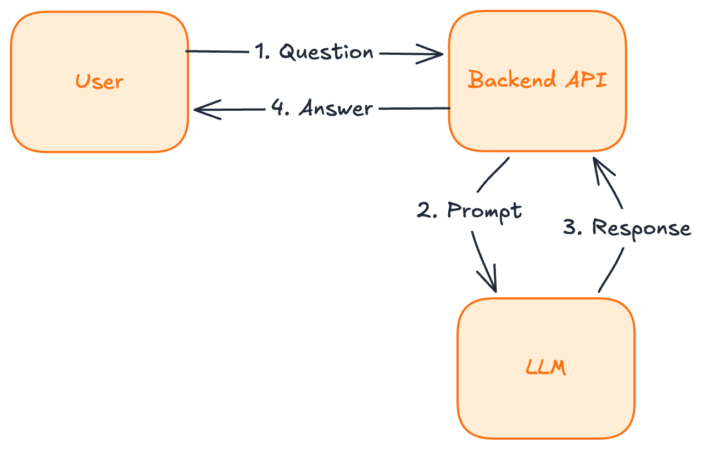
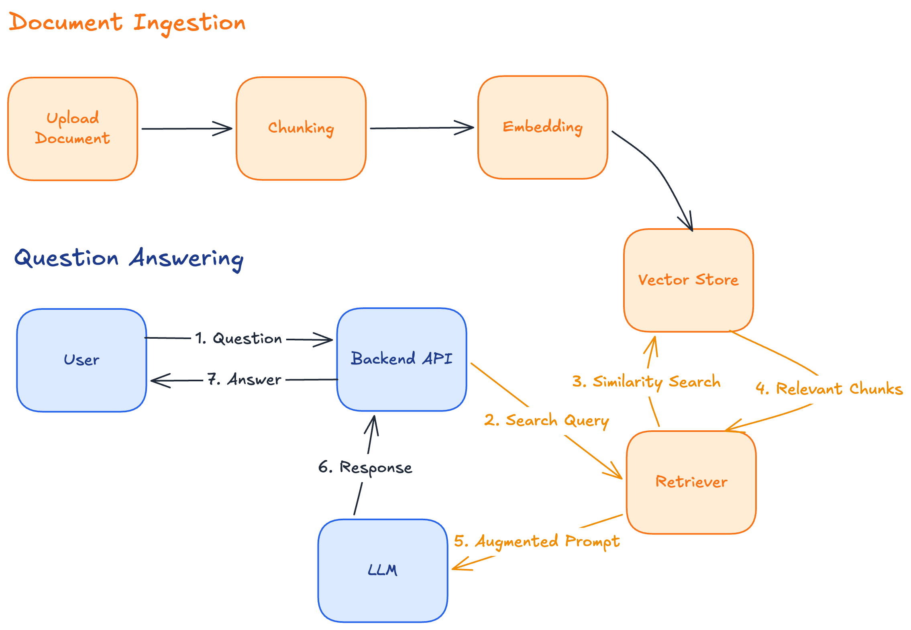
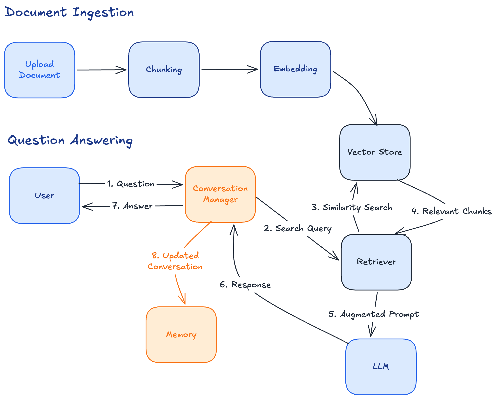
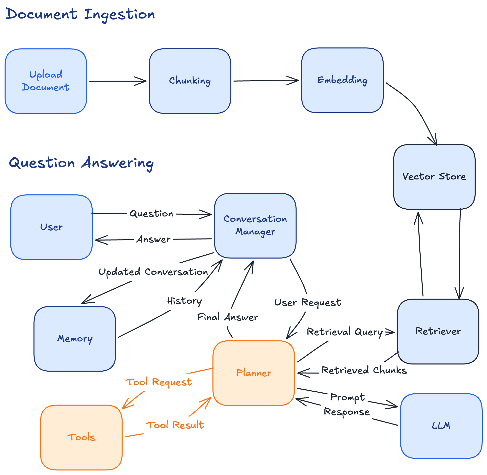
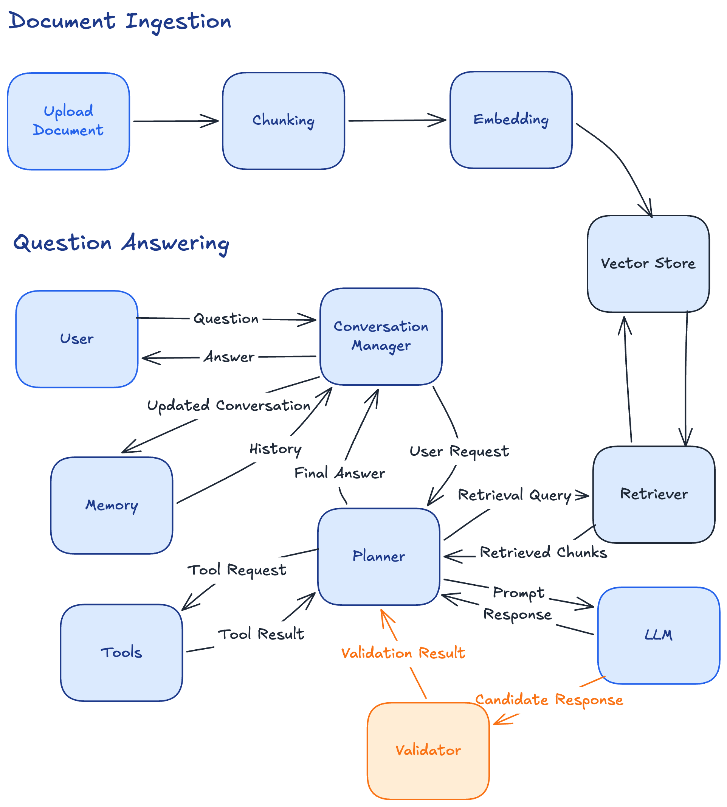
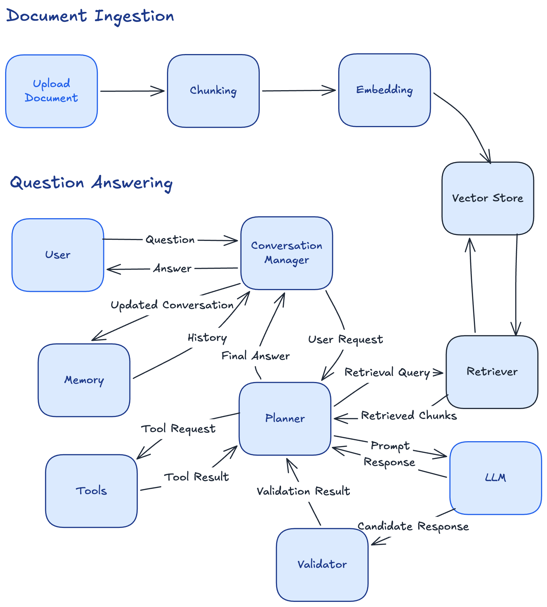

# What Makes a System AI-Native?

> *Every engineering shift begins with a simple question.*

Not long ago, companies rushed to become **cloud-native**.
Today, they're racing to become **AI-native**.

The phrase appears everywhere—job descriptions, startup websites, conference talks, architecture diagrams—but ask ten engineers what it actually means and you'll likely get ten different answers.

For some, AI-native simply means adding an LLM to an existing
application.
For others, it means building agents.
Some equate it with Retrieval-Augmented Generation (RAG).
Others think it's synonymous with chatbots.

These interpretations capture pieces of the picture, but they miss the
larger architectural shift taking place.

This article isn't about prompts or vector databases or agents.

It's about understanding **why AI changes the way we design software
systems**.

By the end of this article, we'll evolve a simple application into
something fundamentally different---and along the way, we'll discover
what makes a system truly AI-native.

------------------------------------------------------------------------

## Our Starting Point

Imagine we're building a product called **Ask My Docs**.
The idea is intentionally simple.

A user asks a question.

The application answers it using an LLM.

Our first architecture looks like this.



The backend receives a request, forwards the prompt to the model, and
returns the response.

It works surprisingly well. You can build a prototype in a weekend.

- Is it useful? Absolutely.
- Is it AI-powered? Yes.
- Is it AI-native? **Not yet.**

------------------------------------------------------------------------

## The First Crack Appears

A week later, a customer asks:

> "Can I upload a PDF and ask questions about it?"

No problem. We include the document in the prompt:

``` text
[[System Instructions]]

[[User Question]]

[[Entire PDF]]
```

It works. Until someone uploads a 600-page engineering handbook.

The request fails because the document no longer fits within the model's
context window.

Notice something important.

The problem wasn't *"we need RAG because everyone uses RAG."*

The problem was architectural.

Our design no longer satisfies the product requirements.

Good architecture always follows requirements---not trends.

------------------------------------------------------------------------

## Retrieval Enters the Picture

Instead of sending the entire document, we split it into chunks,
generate embeddings, and retrieve only the relevant pieces.



The system can now work across much larger document collections without placing every document in the prompt.

But the LLM is still just another dependency.

Useful? Definitely.

AI-native? *Still no.*

------------------------------------------------------------------------

## The Product Grows

Users begin asking:

-   Compare this design document with the one I uploaded last week.
-   Remember my coding preferences.
-   Continue from where we left off yesterday.

Now every interaction depends on previous interactions.

The application needs memory.



------------------------------------------------------------------------

## From Answers to Actions

Then a user asks:

- Read this architecture document.
- Summarize it.
- Generate an ADR.
- Create GitHub issues.
- Notify my team.

Now the model isn't simply answering a question. It must orchestrate work.



------------------------------------------------------------------------

## The Hard Problems Begin

As the product grows, new challenges appear.

Traditional software engineering asks:

-   How do we scale?
-   How do we reduce latency?
-   How do we recover from failures?

AI-native systems ask additional questions:

-   How do we evaluate answer quality?
-   How do we detect hallucinations?
-   How do we validate reasoning?
-   When should a human review the output?
-   Which model should perform which task?

These aren't implementation details.

They're architectural concerns.

------------------------------------------------------------------------

## A Different Kind of Software

Traditional software is largely deterministic.

The same inputs should produce the same outputs.

AI-native systems are probabilistic.

The same prompt may produce multiple acceptable---or
unacceptable---answers.

Validation replaces assumption.

Evaluation becomes part of the architecture.

Confidence becomes a design concern.



------------------------------------------------------------------------

## So What Makes a System AI-Native?

At this point our application has transformed.

- Planning.
- Retrieval.
- Memory.
- Reasoning.
- Tool use.
- Validation.

These aren't optional features. They're architectural building blocks.

An AI-native system isn't defined by calling an LLM.

It's defined by making intelligence a **first-class architectural
primitive**.

Alongside databases, queues, and caches, we now design with:

-   Context
-   Retrieval
-   Memory
-   Planning
-   Tool execution
-   Evaluation
-   Reflection
-   Human oversight

------------------------------------------------------------------------

## The Journey Has Just Begun

We started here.


We ended here.



Every new component solved a limitation in the previous architecture.

That's how real systems evolve.

------------------------------------------------------------------------

## Introducing Project Gyaan

The application we've evolved throughout this article isn't
hypothetical.

Over the course of this series, we'll continue building it.

We'll explore every architectural decision, trade-off, abstraction, and
failure mode.

By the end, it won't simply answer questions.

It will retrieve knowledge, reason across sources, use tools, generate
engineering artifacts, evaluate its own outputs, and support real
software engineering workflows.

We call that system **Project Gyaan**.

This article introduced the destination.

The rest of the series is the journey.

------------------------------------------------------------------------

## What's Next?

In traditional software engineering, source code is the program.

In AI-native systems, prompts increasingly define system behavior.

In the next article we'll explore **Prompts as Programs**, and why
prompt engineering is really software engineering in disguise.
