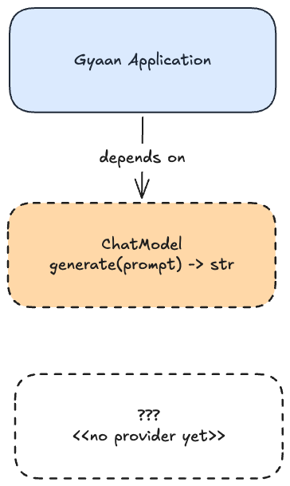
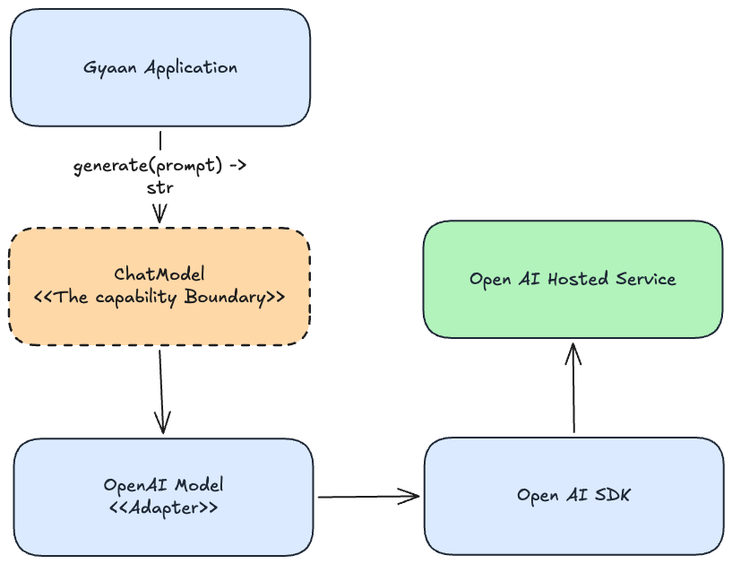
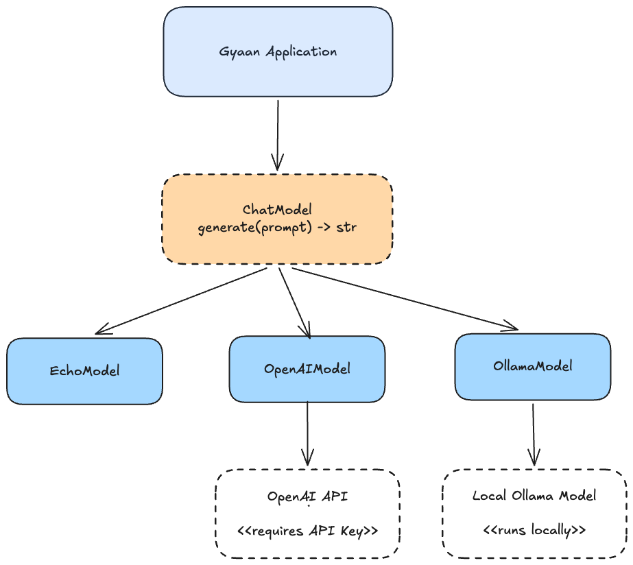
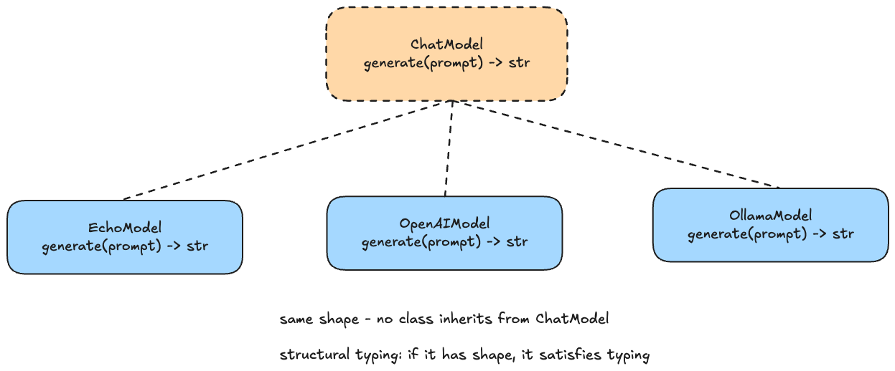
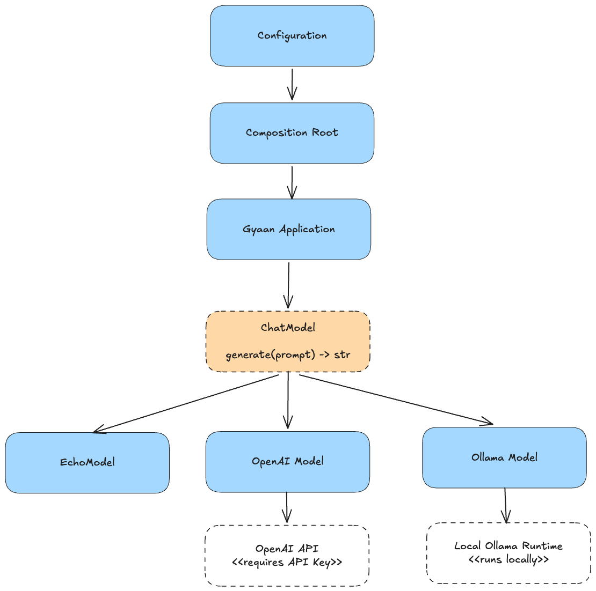
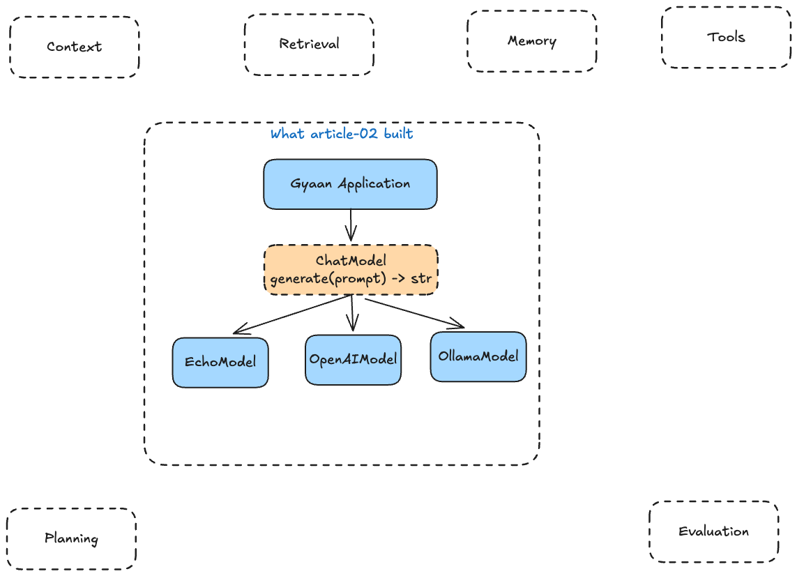

# Building the First AI-Native System

In the previous [article](../article-01/01-What-makes-system-ai-native.md), we asked a deceptively simple question:

**What actually makes a system AI-native?**

We ended up with an architectural answer rather than a product label.

An AI-native system is not simply an ordinary application with an LLM
API attached to it. Intelligence has to become a first-class capability
of the system.  Something the architecture is designed around rather
than something hidden inside one API call.

That sounds reasonable on a diagram.
Now we have to build it.

And this is where architectural ideas become much more interesting,
because code forces us to make decisions that boxes and arrows
conveniently let us postpone.

So for this article, we are going to build the first executable version
of Gyaan.

Not a research assistant yet.

No retrieval. No memory. No tools. No planning. No agents. No vector
database. No framework.

For now, Gyaan will do one thing:

```text
Question -> Model -> Answer
```

That is deliberately primitive.

The goal of this article is not to build something impressive. It is to
establish the smallest architecture that we can evolve without tying the
application itself to OpenAI, Ollama, or whatever model provider comes
next.

------------------------------------------------------------------------

## Start With a Program, Not an LLM

There is a tempting way to begin an AI application.

Install an SDK.

Write something like:

``` python
client = OpenAI()
response = client.responses.create(...)
```

Print the result. Done.

And for an experiment, that is perfectly reasonable.

But Gyaan is not meant to be an SDK demo. We are building a system that
will eventually accumulate retrieval, memory, tools, planning,
evaluation, workflows, and other capabilities.

If we begin by letting a provider SDK define the shape of the
application, we have already made an architectural decision --- whether
we intended to or not.

So the first commits on this branch did something much less exciting.

We created a normal Python project.

A `pyproject.toml`.

A `src/` package. Tests. A command-line entry point.

The first executable version of Gyaan did not contain any AI at all.

That is important.

AI-native software is still software.

Before we introduce probabilistic behavior, external services, API
credentials, model availability, or provider SDKs, we want an
application that can be installed, executed, tested, and evolved like
any other application.

The repository's commit history preserves that progression
intentionally. If you walk through the Article 02 branch commit by
commit, the architecture emerges rather than appearing fully formed.

------------------------------------------------------------------------

## What Does Gyaan Actually Need From a Model?

Once we had an executable application, the next question was not:

> Which model should we use?

It was:

> What does the application need a model to do?

At this point, the answer is almost embarrassingly small.

Given a prompt, generate some text.

That gives us our first AI capability:

``` python
from typing import Protocol


class ChatModel(Protocol):
    def generate(self, prompt: str) -> str:
        ...
```

There is deliberately very little here.

No OpenAI request objects.

No Ollama response types.

No temperature.

No token limits.

No streaming.

No tool calls.

No structured output.

Just the capability the application needs **today**.

This distinction matters.

`ChatModel` is not trying to model everything an LLM could possibly do.
It defines what **Gyaan currently needs from something capable of
generating text**.

That keeps the dependency pointing in the right direction.

The application defines the capability it requires. Infrastructure
implementations adapt themselves to that capability.

Not the other way around.



------------------------------------------------------------------------

## Our First Model Isn't Intelligent

Now we need something that satisfies that capability.

We could immediately connect OpenAI.

Instead, we built this:

``` python
class EchoModel:
    def generate(self, prompt: str) -> str:
        return f"Echo: {prompt}"
```

Yes.

Our first "model" just repeats the question.

``` text
$ gyaan "What makes a system AI-native?"

Echo: What makes a system AI-native?
```

Clearly, we have not achieved AGI.

But `EchoModel` gives us something surprisingly valuable:
**determinism**.

Before introducing a real LLM, we can exercise the entire application
path:

```text
CLI --> GyaanApplication --> ChatModel --> EchoModel
```

We can test argument handling.

We can test dependency wiring.

We can test the application.

We can run Gyaan locally.

And none of those tests need an API key, network connection, local model
server, credits, or assumptions about what a probabilistic model might
return.

This is going to become increasingly important as Gyaan grows.

AI systems contain nondeterministic components, but that does not mean
the entire system should become nondeterministic.

Quite the opposite.

We want to keep as much of the surrounding system deterministic as
possible and isolate probabilistic behavior behind explicit boundaries.

`EchoModel` gives us that boundary before we have even introduced a real
model.

It also remains Gyaan's default provider.

That means someone cloning the repository can run the application
immediately without setting up any AI infrastructure at all.

------------------------------------------------------------------------

## The Application Doesn't Own the Model

With the capability in place, `GyaanApplication` becomes almost boring:

``` python
class GyaanApplication:
    def __init__(self, model: ChatModel) -> None:
        self._model = model

    def run(self, prompt: str) -> str:
        return self._model.generate(prompt)
```

There is an important decision hiding in those few lines.

`GyaanApplication` does **not** create its model.

It receives one.

That means this:

``` python
GyaanApplication
       |
       v
   ChatModel
```

rather than this:

``` text
GyaanApplication
       |
       v
   OpenAI SDK
```

We could call this dependency injection, and technically that is what it
is.

But the name is less important than the problem it solves.

The application should know what capability it requires.

It should not need to know which concrete infrastructure happens to
provide that capability.

That distinction will matter immediately.

------------------------------------------------------------------------

## Make the Slice Executable

We then gave the command line an actual prompt:

``` text
gyaan "What makes a system AI-native?"
```

The path through the system became:

```text
CLI --> GyaanApplication --> ChatModel --> Response
```

At this point, Gyaan is a complete executable slice.

It just isn't intelligent yet.

That may sound like a strange milestone for an AI project, but I like
this order.

We have established where intelligence belongs before introducing
intelligence itself.

Now we can replace the deterministic implementation with a real LLM and
see whether the architecture survives.

------------------------------------------------------------------------

## Now Add a Real Model

The first real provider we introduced was OpenAI.

This is where it would have been easy for provider-specific concepts to
leak upward into the application.

Instead, OpenAI gets an adapter whose job is straightforward:

1.  accept Gyaan's `generate(prompt)` call;
2.  translate it into the OpenAI SDK request;
3.  invoke the provider;
4.  translate the provider response back into a string.

Conceptually:

``` text
GyaanApplication --> ChatModel --> OpenAIModel --> OpenAI SDK --> OpenAI API
```

The interesting part is not the SDK call.

The interesting part is what **didn't change**.

`GyaanApplication` still receives a `ChatModel`.

Its `run()` method still calls:

``` python
self._model.generate(prompt)
```

The application does not import the OpenAI SDK.

It does not know about OpenAI request objects.

It does not know which model name OpenAI expects.

It does not know where the API key comes from.

Those are infrastructure concerns.



We added automated tests around the adapter and composition without
requiring those tests to call the live API.

We did **not** manually exercise the OpenAI path during this article
because using the API requires paid credits.

That is worth saying explicitly.

An architecture article should not quietly imply that every integration
path was manually verified when it was not.

The OpenAI implementation demonstrates the hosted-provider boundary.
Later, Ollama will give us a real end-to-end LLM execution path without
requiring paid API usage.

------------------------------------------------------------------------

## Who Chooses the Provider?

We now have two implementations:

``` text
          ChatModel
          /      \
         /        \
   EchoModel   OpenAIModel
```

But somebody still has to choose one.

That responsibility does not belong in `GyaanApplication`.

Instead, we move that decision to the edge of the system --- the place
where the application is assembled.

In the current implementation, configuration selects a provider and the
composition root constructs the corresponding model before injecting it
into the application.

Conceptually:

``` text
       GYAAN_PROVIDER
             |
             v
     create_application()
             |
       +-----+------+
       |            |
       v            v
   EchoModel    OpenAIModel
       \            /
        \          /
         v        v
       GyaanApplication
```

The environment variable is not the important architectural idea here.

We could eventually get configuration from a file, deployment system,
service configuration, or something else.

The important idea is:

> **Changing the model provider should change how the application is
> composed, not how the application works.**

That is a very different architecture from scattering provider checks
through application code:

``` python
if provider == "openai":
    ...
elif provider == "ollama":
    ...
```

inside every place that needs intelligence.

Provider selection happens once, at composition.

After that, the application talks to a `ChatModel`.

Echo remains the default because the default development experience
should not require external infrastructure.

OpenAI can be selected when credentials and credits are available.

Now we need to find out whether this abstraction actually represents
Gyaan's needs --- or whether we have accidentally created an
OpenAI-shaped interface and given it a generic name.

For that, we need a second real provider.

------------------------------------------------------------------------

## Ollama Is the More Interesting Test

Adding Ollama might look like another integration feature.

Architecturally, it serves a more important purpose.

OpenAI is a hosted service.

Ollama runs models locally.

Different SDK.

Different response structure.

Different operational assumptions.

No hosted API key.

A local model has to exist.

The Ollama service has to be running.

These are meaningfully different infrastructure choices.

But from Gyaan's point of view, the requirement has not changed:

``` python
generate(prompt: str) -> str
```

So we implement `OllamaModel` behind the same capability.

Now the architecture looks like this:




This is where the abstraction starts earning its existence.

If `ChatModel` were simply a wrapper around OpenAI terminology, adding
Ollama would expose that immediately.

Instead, the application stays unchanged.

Only the infrastructure implementation and composition configuration
change.

That is the behavior we wanted.

### Running a real local LLM

For the local integration, we used Ollama with `qwen3:0.6b`.

After installing Ollama and pulling the model:

``` bash
ollama pull qwen3:0.6b
```

Gyaan can be configured with:

``` bash
export GYAAN_PROVIDER=ollama
export GYAAN_MODEL=qwen3:0.6b
```

and then run normally:

``` bash
gyaan "What makes a system AI-native?"
```

This path was exercised end to end.

The choice of `qwen3:0.6b` is not a statement about model quality. It is
a small model that makes it convenient to verify the architecture and
local integration.

And that verification gives us something more useful than merely seeing
generated text in a terminal.

We have now changed from:

``` text
deterministic local implementation
```

to:

``` text
hosted LLM implementation
```

to:

``` text
local real-LLM implementation
```

without rewriting the application layer.

That is the architectural result.

------------------------------------------------------------------------

## The Capability Is the Contract, Not the Class Hierarchy

There was one more refinement on this branch.

Initially, it is natural to think of the relationship like this:

``` python
class OpenAIModel(ChatModel):
    ...
```

and:

``` python
class OllamaModel(ChatModel):
    ...
```

That works.

But Python gives us another option.

`ChatModel` is a `Protocol`.

Protocols support structural typing.

That means a class does not need to explicitly inherit from `ChatModel`
to satisfy the contract.

If it has the required shape:

``` python
def generate(self, prompt: str) -> str:
    ...
```

then a static type checker can treat it as compatible with `ChatModel`
where that protocol is expected.

So the provider implementations can simply be:

``` python
class EchoModel:
    def generate(self, prompt: str) -> str:
        ...
```

``` python
class OpenAIModel:
    def generate(self, prompt: str) -> str:
        ...
```

``` python
class OllamaModel:
    def generate(self, prompt: str) -> str:
        ...
```

None of them need to inherit from `ChatModel`.

That may seem like a small Python detail, but I think it fits the
architecture better.

`ChatModel` is describing a **capability**.

It is saying:

> Gyaan can work with anything that provides this behavior.

It is not saying:

> Every model provider in the world must join our class hierarchy.



This also makes adapters pleasantly independent.

An OpenAI adapter does not need to know that some application-level
protocol exists in order to be useful. It simply provides the behavior
required by that protocol.

We still get type checking at the boundary.

But we avoid coupling implementations through inheritance that provides
us no real value.

The final branch commit intentionally makes this change. It is a nice
example of the architecture becoming simpler after we had enough
implementations to understand what the abstraction really meant.

------------------------------------------------------------------------

## What Are We Actually Testing?

Once LLMs enter a system, it is easy to assume that testing must
immediately become an AI evaluation problem.

Eventually, part of it will.

But look at what we have built so far.

There is a lot we can test deterministically.

We can test that `GyaanApplication` delegates to the model capability
correctly.

We can test `EchoModel` exactly.

We can test CLI behavior.

We can test that provider configuration selects the correct
implementation.

We can test the OpenAI and Ollama adapters against controlled/mock
clients.

We can test configuration errors.

None of those require asking a real LLM whether its answer is "good."

That separation is useful.

A future Gyaan will absolutely need evaluation for probabilistic
behavior. We will need to reason about answer quality, retrieval
quality, tool selection, groundedness, and other model-dependent
behavior.

But evaluation should not replace ordinary software tests.

A useful AI-native system will contain both:

``` text
Deterministic software behavior
            +
Probabilistic model behavior
```

and we should test each appropriately.

The model boundary helps us keep those worlds from becoming
unnecessarily tangled.

Echo is particularly useful here because it gives the application a
completely deterministic `ChatModel`.

We can verify the machinery surrounding intelligence without invoking
intelligence.

That sounds simple now.

It will become much more valuable as the machinery grows.

------------------------------------------------------------------------

## Why Not Just Use LangChain?

At this point someone might reasonably ask why we are writing these
abstractions ourselves.

There are frameworks that already provide model interfaces, provider
adapters, configuration mechanisms, tool abstractions, agents, memory,
and much more.

That is true.

And later, after understanding the underlying architecture, we will be
in a much better position to evaluate what those frameworks buy us.

But using one now would hide exactly the decisions this series is trying
to examine.

`ChatModel` is intentionally tiny because **we discovered the boundary
from Gyaan's needs**.

`GyaanApplication` receives the capability because **we decided where
the dependency should point**.

Provider selection lives in composition because **we decided
infrastructure choice should not leak into application behavior**.

Echo exists because **we want deterministic execution independent of AI
infrastructure**.

These decisions matter whether the eventual implementation uses a
framework or not.

If a framework later makes some of them easier, great.

But we should understand the architecture before outsourcing it.

That is the point of building Gyaan from first principles.

------------------------------------------------------------------------

## A Small Architecture With Somewhere to Grow

Let's look at what exists now.

We have an application layer:

``` text
GyaanApplication
```

We have an explicit model capability:

``` text
ChatModel
```

We have a deterministic implementation:

``` text
EchoModel
```

We have a hosted-provider implementation:

``` text
OpenAIModel
```

We have a local-provider implementation:

``` text
OllamaModel
```

We have configuration-driven composition that decides which
implementation gets injected.

We have deterministic tests around the application and provider
boundaries.

And we have exercised a real local LLM end to end through Ollama.

All of that produces a remarkably small architecture:



There is a principle underneath all of this that I expect we will keep
returning to:

> **Gyaan depends on the capability to use intelligence, not on the
> infrastructure that happens to provide it.**

Today that capability is almost comically small.

That is fine.

We should resist designing abstractions for features we do not have yet.

When Gyaan needs richer model interactions, we will have real problems
against which to evolve the contract.

------------------------------------------------------------------------

## This Is Still a Very Primitive AI System

We should also be clear about what we have **not** built.

Right now, Gyaan can take a prompt and generate text.

That is essentially it.

It does not know how to assemble richer prompts.

It has no dynamic context.

It cannot retrieve knowledge.

It remembers nothing.

It cannot use tools.

It does not plan.

It does not evaluate its own output.

It has no durable workflow behavior.

If our goal were merely to build a chatbot, we could continue adding SDK
features around `generate()`.

But Gyaan is supposed to become a research and knowledge assistant.

That requires much more than text generation.



And this is exactly where I want the project to be.

We have not tried to predict the final architecture.

We have not introduced a framework that gives us ten abstractions before
we have ten problems.

We have not built memory because "AI applications need memory."

We have not added retrieval because "RAG is part of the stack."

We have built the smallest useful slice and stopped.

Now the limitations are real.

And those limitations can drive the next architectural decisions.

------------------------------------------------------------------------

## What We Built

At the end of Article 01, Gyaan was mostly an architectural idea.

At the end of Article 02, it runs.

It has:

-   an application layer;
-   an explicit model capability;
-   replaceable provider implementations;
-   deterministic testing;
-   configuration-driven composition;
-   a zero-infrastructure Echo path;
-   a hosted OpenAI integration;
-   a verified local Ollama execution path;
-   and a lightweight structural contract that does not force provider
    implementations into an inheritance hierarchy.

That is not yet an intelligent research assistant.

But it is something more important for where we are in the series:

**the smallest architecture in which intelligence has a clear place to
live.**

From here, every new capability has somewhere to attach --- and every
abstraction will have to justify why it exists.

That is where Gyaan starts becoming interesting.
