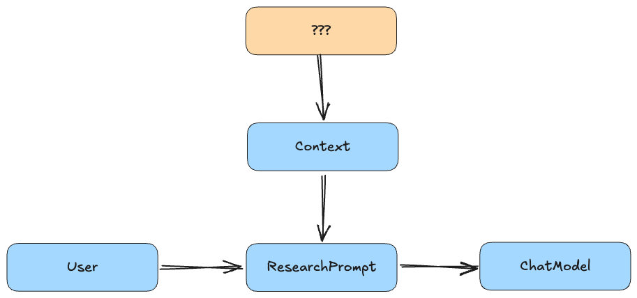
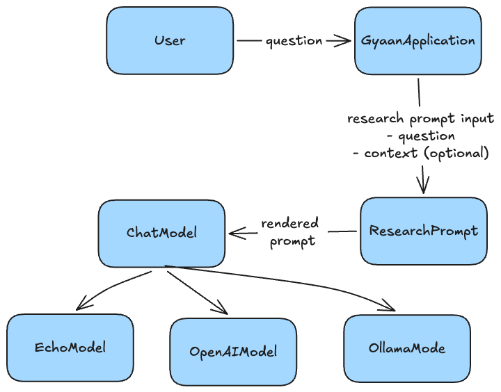

# Prompts as Programs

In the [previous
article](../article-02/02-building-the-first-ai-native-system.md), we
built the first working version of Gyaan.

The architecture was intentionally small:


The application accepted a question, selected a model implementation,
sent the question to that model, and returned the response. It worked.
But there was an important problem hiding inside that simplicity.

The application was effectively doing this:

``` python
model.generate(question)
```

The user's question was also the model's prompt.

Those two things should not be the same.

That distinction is where the next piece of an AI-native architecture
begins.

------------------------------------------------------------------------

## The Prompt Is Application Behavior

Consider a user asking Gyaan:

``` text
What makes a system AI-native?
```

Sending that string directly to a language model will probably produce a
reasonable answer.

But what exactly have we told the model?

Almost nothing.

We have not told it what Gyaan is.

We have not told it how Gyaan should answer.

We have not provided any information the application knows that the
model might need.

We have simply forwarded user input to an external model.

A real application needs to establish its own behavior around that
input.

It might want the model to act as a research assistant. It might provide
retrieved documents. It might specify output constraints, available
tools, or rules the model should follow.

The model should therefore receive something closer to:

``` text
You are Gyaan, a research assistant.
Answer the following question clearly and accurately.

Question:
What makes a system AI-native?
```

The user still owns the **question**.

But the application owns the **prompt**.

That gives us an important architectural distinction:

``` text
User Input != Model Prompt
```

A prompt is not merely text entered by the user.

It is a programmatically constructed representation of what the
application wants the model to do.

In that sense, **prompts are programs**.

------------------------------------------------------------------------

## Step 1: Stop Forwarding Raw User Input

The first change on this branch deliberately did not introduce a new
abstraction.

Instead, Gyaan started constructing the prompt directly inside
`GyaanApplication`.

Conceptually, the application moved from:

``` python
model.generate(question)
```

to something like:

``` python
prompt = (
    "You are Gyaan, a research assistant.\n"
    "Answer the following question clearly and accurately.\n\n"
    f"Question:\n{question}"
)

model.generate(prompt)
```

This is a small change, but architecturally it changes the meaning of
the system.

Before: 

After:


The application now controls what crosses the model boundary.

That is the important change.

The implementation was intentionally inline at first. We could have
immediately created a `PromptTemplate`, `PromptBuilder`,
`PromptManager`, or some other abstraction. But doing that would have
skipped an important design step.

First establish the behavior. Then see what responsibility emerges.

------------------------------------------------------------------------

## Step 2: Give Prompt Construction a Home

Once prompt construction existed, another problem became visible.

`GyaanApplication` now had two responsibilities.

It orchestrated the request:

``` text
question -> prompt -> model -> response
```

But it also knew how a research prompt should be constructed.

Those are different concerns. The application should coordinate
components.

It should not contain the details of how a research prompt should be
constructed.

So the next commit extracted prompt construction into a dedicated
component:

``` python
class ResearchPrompt:
    def build(self, ...):
        ...
```

Now the flow becomes:


`GyaanApplication` orchestrates.

`ResearchPrompt` constructs the model input.

`ChatModel` executes the model call.

Each responsibility has an explicit home.

------------------------------------------------------------------------

## Why `ResearchPrompt` and Not `PromptTemplate`?

There is a tempting move here.

Once we discover that prompts deserve their own component, we might
create a generic abstraction:

``` python
class PromptTemplate(Protocol):
    def build(...) -> str:
        ...
```

Then perhaps a registry:


Or maybe a `PromptManager`.

Gyaan does none of those things.

There is currently one prompt-building concern:

``` text
ResearchPrompt
```

So we use one concrete class.

This follows the same principle we have used throughout the project:

> Introduce abstractions when the architecture requires them, not when
> we can imagine needing them someday.

A generic prompt abstraction may eventually become useful.

Today it would mostly encode speculation.

That distinction matters especially in AI systems, where it is easy to
introduce frameworks and abstraction layers long before we understand
the behavior they are supposed to represent.

Gyaan is deliberately taking the opposite path.

Let the architecture emerge from concrete requirements.

------------------------------------------------------------------------

## A Prompt Has More Than One Input

Once prompt construction had its own home, another limitation became
obvious.

A useful research prompt will eventually contain more than the user's
question.

Imagine that Gyaan has discovered relevant information:

``` text
Gyaan is an educational project that builds AI-native systems
incrementally from first principles.
```

The model may need both that information and the user's question.

So the prompt is no longer a function of a single string.

Conceptually:

``` text
Prompt = Instructions + Context + Question
```

That gives us three different kinds of information:

``` text
Instructions
    What should the model do?

Context
    What information should the model know?

Question
    What is the user asking?
```

These inputs have different ownership and different semantics.

Treating them as one giant string would erase those distinctions.

------------------------------------------------------------------------

## Making the Input Explicit

Gyaan therefore introduces a small value object:

``` python
@dataclass(frozen=True)
class ResearchPromptInput:
    question: str
    context: str | None = None
```

And `ResearchPrompt` now accepts that object:

``` python
class ResearchPrompt:
    def build(self, prompt_input: ResearchPromptInput) -> str:
        ...
```

This might look like a minor implementation detail.

It is actually establishing an important boundary.

The prompt builder no longer accepts an ambiguous string.

It accepts structured application data.

Today that structure contains:

``` text
question
context
```

Later, prompt construction could receive other explicit inputs if the
architecture genuinely requires them.

The important part is that those inputs remain visible as data rather
than being prematurely flattened into prompt text somewhere else in the
application.

------------------------------------------------------------------------

## Context Is Data, Not Instructions

The final prompt deliberately separates its sections:

``` text
You are Gyaan, a research assistant.
Answer the following question clearly and accurately.

Context:
Gyaan is built from first principles.

Question:
What makes a system AI-native?
```

This structure reflects the architecture.

The first section is controlled by the application:

``` text
Instructions
```

The second represents information supplied to the model:

``` text
Context
```

The third represents the user's request:

``` text
Question
```

These distinctions become increasingly important as the system grows.

Retrieved documents should not silently become application instructions.

A user's question should not silently become system behavior.

Application policy should not be mixed with retrieved data.

The application should preserve those distinctions while constructing
model input, even though the model ultimately receives them together.

------------------------------------------------------------------------

## An Interesting Gap Appears

There is something intentionally incomplete about the implementation.

`ResearchPromptInput` supports context:

``` python
ResearchPromptInput(
    question=question,
    context=context,
)
```

But `GyaanApplication` does not yet have any context to provide.

It still effectively creates:

``` python
ResearchPromptInput(question=question)
```

This is deliberate.

We have established **where context belongs before deciding where
context comes from**.

That distinction prevents us from jumping prematurely into retrieval
infrastructure.

At this point the architecture knows how to consume context:


But there is nothing upstream that can produce it:



That missing component is now visible.

And visible architectural gaps are useful.

They tell us what problem we actually need to solve next.

------------------------------------------------------------------------

## Prompts Should Be Deterministic

There is another useful property of `ResearchPrompt`.

It does not call a model. It does not access the network. It does not
retrieve documents. It does not depend on external state.

Given the same `ResearchPromptInput`, it produces the same string.

In other words:

``` text
ResearchPromptInput
        |
        v
 ResearchPrompt
        |
        v
      string
```

is deterministic.

That makes prompt construction ordinary testable software.

We can verify that application instructions are present.

We can verify that the question is included.

We can verify that context appears when supplied.

We can verify that the context section disappears when context is
absent.

We can verify ordering:

``` text
Instructions
Context
Question
```

None of those tests require a language model.

That is a valuable boundary.

------------------------------------------------------------------------

## Deterministic vs. Probabilistic Components

The architecture now contains two very different kinds of components.

`ResearchPrompt` is deterministic:

``` text
Input -> predictable output
```

`ChatModel` is probabilistic:

``` text
Prompt -> model-dependent output
```

Our tests should respect that difference.

There is little value in mocking `ResearchPrompt`.

It is cheap, deterministic, and has no I/O.

We can simply use the real implementation.

`ChatModel`, on the other hand, represents an external model boundary.

Tests of application orchestration should not depend on OpenAI, Ollama,
network access, latency, cost, or nondeterministic model output.

So the model boundary is replaced in tests while the prompt builder
remains real.

Conceptually:


This is more than a testing convenience.

It reveals the architecture.

Good tests often do that.

They show which parts of the system we control completely and which
parts cross into uncertain external behavior.

------------------------------------------------------------------------

## Not Every Component Needs an Interface

Article 02 introduced `ChatModel` as an abstraction because Gyaan
genuinely had multiple model implementations:

``` text
- EchoModel
- OpenAIModel
- OllamaModel
```

It would be easy to conclude that `ResearchPrompt` should also have an
interface or `Protocol`.

But why?

There is one implementation.

It has no external I/O.

It is deterministic.

We do not need to substitute it in tests.

Creating a protocol purely because dependency injection is involved
would add another abstraction without solving a problem.

So `ResearchPrompt` remains a concrete class.

Again, the rule is not:

> Everything should have an interface.

The rule is:

> Create a boundary when the system has a reason for that boundary to
> exist.

For `ChatModel`, that reason exists.

For `ResearchPrompt`, it currently does not.

------------------------------------------------------------------------

## Prompt Engineering vs. Prompt Architecture

Much of the discussion around prompts focuses on wording:

-   Should we use few-shot examples?
-   Should we provide examples of the desired output?
-   How detailed should the instructions be?
-   Which phrasing produces better results?

Those are useful questions.

But they are mostly questions of **prompt engineering**.

There is another layer beneath them: **prompt architecture**.

Before optimizing the words inside a prompt, a system needs to answer
questions like:

-   Who owns the prompt?
-   Where is it constructed?
-   What inputs can influence it?
-   Which inputs are application instructions?
-   Which inputs are user data?
-   Which inputs are retrieved context?
-   Can prompt construction be tested without calling a model?
-   Can the rest of the application understand the difference between a
    user question and a model prompt?

Those are software architecture questions.

And they matter regardless of which model ultimately receives the
prompt.

------------------------------------------------------------------------

## Prompts Are Part of the Application

This leads to the central idea of this article.

A production prompt is not merely a clever paragraph stored somewhere in
the codebase.

It represents application behavior.

Changing:

``` text
Answer the question.
```

to:

``` text
Answer only using the supplied context.
```

can fundamentally change what the application does.

Adding context changes what information is available to the model.

Changing the ordering or interpretation of sections can change how
inputs interact.

As Gyaan grows, prompts may incorporate retrieved knowledge, tool
results, conversation state, validation feedback, or other
system-produced information.

Those decisions belong to the application architecture.

That means prompts deserve many of the same engineering properties we
expect from other application behavior:

``` text
- explicit ownership
- clear inputs
- deterministic construction
- testability
- version control
- reviewable changes
```

The model call may be probabilistic.

The software that prepares that call does not have to be.

------------------------------------------------------------------------

## The Architecture So Far

Article 02 established the model boundary. After this article, the
architecture has evolved:



The system is still small.

But its boundaries are becoming more meaningful.

The user provides a question.

The application decides how that question becomes model input.

The prompt component deterministically combines instructions, context,
and the question.

The model is responsible for generation.

And the application returns the result.

Each step has a distinct responsibility.

------------------------------------------------------------------------

## What We Deliberately Did Not Build

Just as important as what we added is what we did not add.

There is still:

-   no prompt framework
-   no generic prompt registry
-   no prompt management service
-   no retrieval system
-   no vector database
-   no memory
-   no tools
-   no agent loop
-   no orchestration framework

Gyaan does not need those things yet.

Adding them now would make the system look more sophisticated while
making the architectural lessons harder to see.

Instead, we introduced one new idea:

``` text
User input is not the model prompt.
```

Then we followed the consequences of that idea until the responsibility
had a clear home.

That is enough for this stage.

------------------------------------------------------------------------

## The Next Problem Is Now Obvious

The prompt can accept context.

But nothing in Gyaan can produce context.

Suppose the user asks:

``` text
What architectural decisions has Project Gyaan made so far?
```

The model may know nothing about the repository. The information exists
somewhere --- perhaps in articles, ADRs, documentation, or source code
--- but Gyaan currently has no way to find it and supply it to
`ResearchPrompt`.

Our architecture therefore contains an empty slot:


That is where the next stage begins.

We need a way to take a question, find relevant knowledge, and turn that
knowledge into context. But we now know exactly where that context
belongs.

That is the benefit of evolving the system one boundary at a time.

The first version of Gyaan was enough to establish the model boundary:

``` python
model.generate(question)
```

This article established the next principle:

> **The model may generate the answer, but the application owns the
> prompt.**

And now that Gyaan knows how to consume context, the next question is
unavoidable:

**Where does that context come from?**
